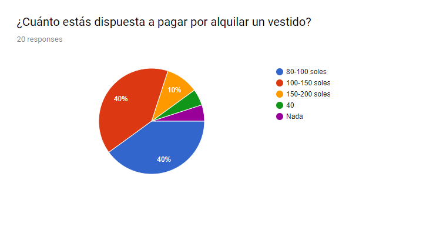
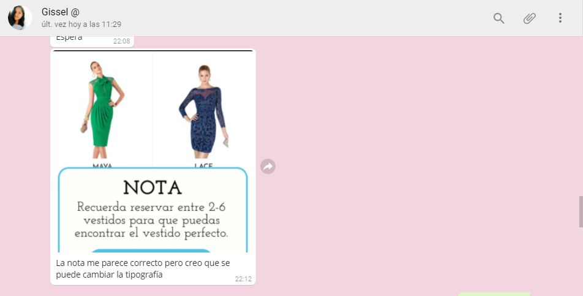

# Fabura

Fabura es una aplicación móvil en la cual podrás reservar de 2 a 6 vestidos elegantes para que te los podamos llevar a tu casa para que te los pruebes o puedas probártelos en tienda. 

## Reto 

Durante este sprint y durante lo que queda del bootcamp deberás trabajar individualmente en diseñar o rediseñar un producto digital.

Si tienes una idea de un producto que te gustaría probar, lo podrás hacer. Podrás identificar y conocer a tus usuarios y hacer las pruebas necesarias para poder validar tu idea.

Es así que basadp en este reto decidí enfocarme en la renta de vestidos, creando un nuevo modelo de negocio y, finalmente, naciendo Fabura.

## Investigación

 Antes de empezar con la investigación, decidí hacer un kick off meeting para establecer mis stakeholders y las preguntas a realizar. Además de tener un precio plan de investigación para poder ejecutarlo luego. 

* **Stakeholders y preguntas**
  * CEO.
    
    * ¿Cuál es la necesidad primaria que se trata de cubrir?

  * Finance Manager.

    * ¿Cuánto se espera crecer con esta nueva estrategia?
    * ¿Cuánto se puede invertir?
    * ¿En cuánto tiempo se espera el retorno?

  * Sales Manager.

    * ¿Cuánto tiempo demoraría capacitar  a los colaboradores con una nueva estrategia de ventas?
    * ¿Cuál es el proceso de Alquiler? ¿Requisitos? ¿Sanciones?

  * Marketing Manager.

    * ¿La campaña digital de los productos cuánta aceptación tiene? 
    * ¿Cuál es el ratio de conversión de visitantes de la página a reserva de cita? ¿De reserva de cita a alquiler?

  * Clientes.
  * Proveedores.
  * Empleados.

* **Plan de investigación**

  * Research Cuantitativo.
  * Research Cualitativo.
  * Encuestas online.
  * Entrevistas presenciales.
  * Benchmarking.

Con esto planteado empecé mi búsqueda de las empresas/negocios que brinden este servicio y encontré cinco:

  * Glam'hour
  * Dress2Go
  * Festana
  * Sfilata
  * El Armario.

  Y me puse en contacto con ellas:

Sin embargo solo una de ellas se dispuso a ayudarme con la parte de “Preguntas a Stakeholders”. Ahora bien, las preguntas a la empresa son diferentes a las preguntas planteadas en el kick meeting para los stakeholders; ya que es muy poco probable que el dueño del negocio/empresa te quiera contar con muchos detalles y/o responder preguntas muy puntuales sobre su Modelo de Negocio. Es así que las hice más genéricas de tal manera que se puedan obtener respuestas interesantes.

* **Preguntas a Empresas similares**

  * ¿Cómo surgió la idea de alquilar vestidos por Facebook?
  * ¿De qué edades son la mayoría de sus clientas?
  * ¿Para qué ocasión es que se alquilan más los vestidos? ¿En qué meses?
  * ¿Si quiero alquilar un vestido cuál es el proceso que debo seguir?
  * ¿Cuál es el promedio del costo de alquiler de un vestido?
  * ¿Alguna vez han pensado en llevar los vestidos a la clienta para que se los pruebe en la comodidad de su casa?
  * Si la respuesta fue afirmativa, ¿por qué no lo implementan?
  * Si la respuesta fue no, ¿por qué?
  * Y para finalizar, ¿qué otro tipo de medio social/digital utilizan para hacer más conocida su empresa?

**Respuesta de la empresa Glam'Hour**

Aquí las preguntas y respuestas:

* **¿Cómo surgió la idea de alquilar vestidos por Facebook?**
 
    Usé el servicio y me pareció que respondía a una necesidad del mercado y q por lo tanto era un negocio con potencial

* **¿De qué edades son la mayoría de sus clientas?**

    Edades diversas, la mayoría tal vez en sus 20s y 30s

* **¿Para qué ocasión es que se alquilan más los vestidos? ¿En qué meses?**

    Tenemos pocos meses de operar por lo que no es posible comparar meses, se alquilan sobre todo para bodas.

* **¿Si quiero alquilar un vestido cuál es el proceso que debo seguir?**

   Sacar cita, elegir, pagar, devolver.

* **¿Cuál es el promedio del costo de alquiler de un vestido?**

     190 soles

* **¿Alguna vez han pensado en llevar los vestidos a la clienta para que se los pruebe en la comodidad de su casa?** 

    Si
* **Si la respuesta fue afirmativa, ¿por qué no lo implementan?** 

    Recien estamos empezando, tal vez en el futuro.
* **Si la respuesta fue no, ¿por qué?**

* **¿Qué otro tipo de medio social/digital utilizan para hacer más conocida su empresa?**

    Instagram.

* **¿La campaña digital de los productos cuánta aceptación tiene?**

    Solo es digital.

* **¿Cuál es el ratio de conversión de visitantes de la página a reserva de cita? ¿De reserva de cita a alquiler?**

     No hemos hecho ese analisis aún.

Siguiendo con el plan de investigación, se realizaron encuestas, entrevistas y benchmarking para poder entender la necesidad a satisfacer.

### **Benchmarking**

Se realizó el benchmarking de los negocios/empresas que están en el sector de alquiler pero sobretodo los que están en Facebook, tales como:

* Glam’Hour. (https://www.facebook.com/glamhourperu/)

* Dress2Go. (https://www.facebook.com/Dress2GoPeru/)

* Festana. (https://www.facebook.com/festanavestidos/)

* Sfilata. (https://www.facebook.com/sfilata.alquilerdevestidos/)

* El Armario. (https://www.facebook.com/ElArmarioVestidos/)

**Outputs** 

* Los 5 negocios ofrecen poder reservar tu vestido e ir a probárselo a tienda, pagar con efectivo, POS y entalle.
* Solo dos negocios ofrecen llevar y recoger el vestido a la dirección que brindes.
* En solo dos negocios tienes la posibilidad de comprar el vestido si es que así lo deseas.
* 4 negocios incluyen lavandería y asesoría dentro del precio del alquiler.
* Solo un negocio ofrece alquilar vestidos desde $50 USD, a pesar de que en los demás negocios su publicidad diga que puedes alquilar desde ese precio.

### **Entrevistas**

Se realizaron 3 entrevistas presenciales con la siguiente guía de entrevista:

En el siguiente link se pueden observar los audios y videos de las entrevistas (https://drive.google.com/drive/folders/1Hucafwk5Fl-obd1khqEUisU-_QfEm2sd?usp=sharing)

**Outputs** 

* Normalmente los vestidos que se compran solo se usan una vez.
* Se invierte bastante tiempo al ir a la tienda a probarte el vestido.
* El precio de comprar un vestido es muy alto para solo usarlo una vez.

### **Encuestas**

Se obtuvieron 20 respuestas que ayudaron a definir (más adelante) nuestro User Persona.

Aquí las preguntas:

Aquí algunas respuestas que pueden ser calificadas de forma numérica:

En el caso de las preguntas "¿Cuántos vestidos te pruebas antes de alquilar/comprar? y ¿cuántas tiendas visitas antes de comprar/alquilar?" solo se observan 6 respuestas ya que se agregaron después de sacar el survey al público. Se agregaron después porque sabía que me iban a dar un insight muy importante para poder entender la necesidad.

## Síntesis

### Mapa de Afinidad

Antes de realizar el Mapa de Afinidad, se realizó una síntesis de la información recabada en las encuestas y entrevistas presenciales que se realizaron. 
Como paso siguiente a la síntesis se realizó el mapa de afinidad obteniendo el siguiente diagrama y los posteriores insights.

#### El problema

“Las mujeres compran vestidos para asistir a Matrimonios, Graduaciones y Cenas de Gala; con una frecuencia de 3 veces al año. Calificando su experiencia como buena/regular al realizar esta actividad y que preferirían tener accesorios a la mano a la hora de elegir el vestido.”

## Ideación

### User Primary Person

* Nombre: Daniela Merino
* Edad: 21 años
* Ocupación: Estudiante.
* Carrera: Administración de Negocios Internacionales.
* Universidad: USIL.
* Trabajo: Sheraton Lima Hotel & Convention Center.
* Frases: “Cuando tengo un evento especial e importante me encanta ir a comprar el vestido perfecto. Lamentablemente, por tener una vida ocupada no puedo tomarme el tiempo necesario para elegir el vestido. Así que termino comprando algo que no llene del todo mis expectativas.”

### Problem Statements

* Daniela necesita encontrar una forma rápida de comprar sus vestidos para no perder tanto tiempo.
* Daniela necesita otras opciones a comprar para ahorrar dinero.
* Daniela necesita darle otro uso a sus vestidos para no sentir que fue una mala inversión

### How might we?

* HMW hacer que compre vestidos más rápido?
* HMW hacer que encuentre accesorios más fácil?
* HMW hacer que alquile un vestido?
* HMW su experiencia alquilando sea agradable?

### What if?

* What if pueda alquilar y comprar su vestido en un solo lugar?
* What if pueda vender sus vestidos?
* What if pueda alquilar sus vestidos?
* What if pueda elegir sus accesorios de forma rápida?
* What if no tenga que moverse para comprar/ alquilar un vestido?

### Feature List

* Que pueda alquilar, vender y comprar vestidos.
* Que sea sencillo.
* Que exista un catálogo de vestidos y accesorios.
* Que se pueda pagar en efectivo y con tarjetas.

### MPV

Después de toda la etapa de síntesis el MPV será un aplicativo móvil en el cuál se podrá alquilar vestidos tanto de la tienda cómo hacer de mediador a la tienda para alquilar sus propios vestidos Creando así un nuevo modelo de negocios y una comunidad para un consumo más responsable a la hora de comprar un vestido que solo será usado una vez la mayor parte del tiempo.

### BMC

Es así que después de toda la investigación nace este nuevo modelo de negocios llamado FABURA. 

Fabura promete revolucionar la búsqueda del vestido ideal para ese evento tan especial. Desde el aplicativo móvil tu podrás reservar los vestidos que más te gusten para luego decidir si quieres probártelos en nuestra tienda o deseas que te lo llevemos a tu casa. 

## Prototipado

### Prototipo en papel:

Se realizó un único solo prototipo de papel, el cual fue testeado con dos persona. Este prototipo en papel tenía las opciones iniciales de alquilar desde un inicio, es decir, sin que te los pruebes y también la de reserva con la opción de que te los puedan llevar a casa o te los pruebas en tienda. 

* **Feedback**

  * Usuaria 1: Me gusta el filtro, me gusta que se pueda pagar con tarjeta y que puedan llevarlo a mi casa para probármelo. Quisiera poder ver también accesorios.

  * Usuaria 2: Desearía poder tener un espacio donde preguntar y/o hacer consultas.

### Prototipo en alta fidelidad: Fabura V1.0

https://marvelapp.com/640af76/

Se realizó el primer prototipo digital que fue testeado con 3 personas para luego crear una nueva versión de Fabura.

* **Feedback**

### Prototipo en alta fidelidad: Fabura V2.0

Con el feedback recibido se pudo mejorar el prototipo para unsa segunda versión.

https://marvelapp.com/324gg7a/

